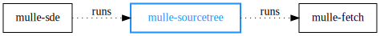

# 🌲 Project composition and maintenance with build support

... for Android, BSDs, Linux, macOS, SunOS, Windows (MinGW, WSL)

Organize your projects freely with multiple archives and repositories.

* maintain local (file, folder) or external tree nodes (archive, repository)
* inherit sourcetrees from dependencies
* override external dependencies with symlinks of local projects
* give build sub-projects in the correct order
* create platform specific #ifdefs and #include statements
* acquire dependencies unique to each platform

| Release Version                                       | Release Notes
|-------------------------------------------------------|--------------
|   | [RELEASENOTES](RELEASENOTES.md) |

## Executables

| Executable                       | Description                                |
|----------------------------------|--------------------------------------------|
| `mulle-sourcetree`               | Maintain sources and dependencies          |
| `mulle-sourcetree-to-c`          | Create header files from sourcetree        |
| `mulle-sourcetree-to-cmake`      | Create cmake files from sourcetree         |
| `mulle-sourcetree-export-json`   | Export mulle-sourcetree config to JSON     |
| `mulle-sourcetree-import-json`   | Import mulle-sourcetree config from JSON   |
| `mulle-sourcetree-export-git`    | Create git submodule statements from config|
| `mulle-sourcetree-export-csv`    | Export mulle-sourcetree config to CSV      |
| `mulle-sourcetree-import-csv`    | Import mulle-sourcetree config from CSV    |
| `mulle-sourcetree-import-sqlite` | Import mulle-sourcetree config from SQLite |
| `mulle-sourcetree-graph`         | Produce a SVG of the dependency tree       |


## Commands

See all available commands with `mulle-sourcetree help`.
Almost all commands will show a help page with
`mulle-sourcetree <command> help`.

#### `mulle-sourcetree add` : add nodes with

``` bash
mulle-sourcetree add \
   --url https://github.com/libexpat/libexpat/archive/R_2_2_5.tar.gz \
   external/expat
```

You can specify your URL with environment variables (with fallback values), to
make the sourcetreee more flexible:

``` bash
mulle-sourcetree add \
   --url '${ZLIB_URL:-https://github.com/madler/zlib.git}' \
   external/zlib
```

#### `mulle-sourcetree json` : see sourcetree

The JSON sourcetree representation gives a nice overview, over its contents:

``` bash
$ mulle-sourcetree json
[
   {
      "address":      "external/expat",
      "nodetype":     "tar",
      "url":          "https://github.com/libexpat/libexpat/archive/R_2_2_5.tar.gz",
      "uuid":         "87DFF521-D6FB-4621-8CEB-713E3B495EFA"
   },
   {
      "address":      "external/zlib",
      "nodetype":     "git",
      "url":          "${ZLIB_URL:-https://github.com/madler/zlib.git}",
      "uuid":         "974C7DFA-A353-43D8-871F-3CFF7ADC1E22"
   }
]
```


#### `mulle-sourcetree sync` : fetch and update nodes

After changing the sourcetree, run *sync* to reflect the changes back
into your project by fetching added and deleting removed dependencies:

``` bash
mulle-sourcetree sync
```


#### `mulle-sourcetree list` : stay in control

See your sourcetree with **list**:

``` bash
$ mulle-sourcetree list --output-header --output-eval
address         nodetype  marks  userinfo  url
-------         --------  -----  --------  ---
external/expat  tar                        https://github.com/libexpat/libexpat/archive/R_2_2_5.tar.gz
external/zlib   git                        https://github.com/madler/zlib.git
```

Use custom format options to retrieve the information you want. This example
lists all the URLs definitions used in your project:

``` bash
$ mulle-sourcetree list -r \
                        --format "%u\n" \
                        --output-no-header \
                        --output-no-indent \
| sed -n 's/^\${\([A-Z_]*\):-\(.*\)}$/\1=\"\2\"/p' \
| sort -u
```

#### `mulle-sourcetree move` : change node order

The order in which dependencies are build or libraries are linked can be
important.

``` bash
mulle-sourcetree move external/zlib top
```


#### `mulle-sourcetree dotdump` : picture your sourcetree

Get a graphical overview with **dotdump**. The output format is the
[Graphviz](https://graphviz.org/) `.dot` format. Use `dot` to convert it to
PNG or SVG:

``` bash
$ mulle-sourcetree dotdump --td > pic.dot
dot -Tsvg -o pic.svg pic.dot     #
open pic.svg
```


Or try `mulle-sourcetree-graph` for a more abstract view.

#### `mulle-sourcetree craftorder` : retrieve projects to build

``` bash
mulle-sourcetree craftorder
/private/tmp/a/external/expat
/private/tmp/a/external/zlib
```

#### `mulle-sourcetree-import-json` : edit the sourcetree config as JSON

You can edit the JSON output from `mulle-sourcetree-json` and import it back
with:

``` bash
mulle-sourcetree-import-json
```


#### `mulle-sourcetree-edit-csv` : edit the sourcetree config with a spreadsheet

These commands need sqlite3 and a spreadsheet editor installed:

``` bash
mulle-sourcetree-edit-csv
mulle-sourcetree-export-csv
mulle-sourcetree-import-csv
mulle-sourcetree-import-sqlite
```

## Sourcetree Nodetypes

These are the known nodetypes. In addition to `address` and `nodetype` some
of the other fields may be used or ignored, depending on the nodetype.

| Nodetype  | Url | Branch | Tag | Fetchoptions | Description                                    |
|-----------|-----|--------|-----|--------------|------------------------------------------------|
| `git`     | YES | YES    | YES | YES          | git repository                                 |
| `local`   | NO  | NO     | NO  | NO           | used for subprojects                           |
| `svn`     | YES | YES    | NO  | YES          | svn repository                                 |
| `symlink` | YES | NO     | NO  | NO           | symbolic link                                  |
| `tar`     | YES | NO     | YES | YES          | tar archive. fetchoptions enable check shasum  |integrity |
| `zip`     | YES | NO     | YES | YES          | zip archive. fetchoptions enable check shasum  |integrity

> `zip` and `tar` use the tag through expansion (see above). If the URL isn't
> properly fashioned, setting the tag will have no affect.


## Sourcetree Marks

A node of a sourcetree can have a variety of pre-defined and user-defined
"marks".  By default a node has **all marks**, even those not yet invented,
except those that are prefixed with "only-". You can selectively remove marks,
by adding the mark prefixed with "no-".


### marks used by mulle-sourcetree

These are a list of marks that are interpreted by mulle-sourcetree during
"sync":

| Mark              | Description                                              |
|-------------------|----------------------------------------------------------|
| `bequeath`        | Node should be used by parent project.                   |
| `descend`         | An inferior sourcetree within this node will be used.    |
| `fs`              | The node has/should have a corresponding file or folder. |
| `require`         | Failure to fetch this node is an error.                  |
| `require-os-<u>`  | Failure to fetch this node on this OS is an error.       |
| `set`             | The node itself can be modified.                         |
| `share`           | The node is shareable with other sourcetrees.            |
| `update`          | The node will be updated after an initial fetch.         |

and during "clean":

| Mark              | Description                                              |
|-------------------|----------------------------------------------------------|
| `delete`          | Can be deleted in a `mulle-sourcetree clean`.            |


### marks used by mulle-sourcetree-to-c

mulle-sourcetree-to-c is used to generate `#include` or `#import`
statements to be included by the project. The output of mulle-sourcetree-to-c
is self documenting!

| Mark                     | Description                                                  |
|--------------------------|--------------------------------------------------------------|
| `dependency`             | This is a dependency (instead of a library).                 |
| `header`                 | Emit an `#include` statement.                                |
| `import`                 | Use `#import` instead of `#include`.                         |
| `no-craft-platform-<os>` | Don't create `#ifdef` shield for given os.                   |
| `no-craft-sdk-<os>`      | Create an `#ifdef` shield for given sdk.                     |
| `no-platform-<os>`       | Same as `no-craft-platform-<os>`                             |
| `no-sdk-<os>`            | Same as "no-craft-sdk-<os>"                                  |
| `public`                 | This is a public header.                                     |
| `require-os-<u>`         | Failure to include this header on this platform is an error. |
| `require`                | Failure to include this header is an error.                  |

### marks used by mulle-sourcetree-to-cmake

mulle-sourcetree-to-cmake is used to generate cmake files for linking.
The output of mulle-sourcetree-to-cmake is also self documenting!

| Mark                         | Description                                                 |
|------------------------------|-------------------------------------------------------------|
| `all-load`                   | Will be linked "wholesale" for Objective-C.                 |
| `cmake-add`                  | Add to the list of libraries to link.                       |
| `cmake-all-load`             | A library that needs all symbols (ObjC).                    |
| `cmake-dependency`           | Inherit foreign `Definitions.cmake` and `DependenciesAndLibraries.cmake`. |
| `cmakeinherit`               | Old spelling of `cmake-inherit`.                            |
| `cmake-inherit`              | Participate in cmake dependency inclusion scheme.           |
| `cmake-intermediate-link`    | Prefixes generated container name with `STARTUP_`           |
| `cmake-loader `              | Inherit foreign MulleObjCLoader for mulle-objc-loader-tool. |
| `cmake-searchpath`           | Add include directory to searchpath (flattens headers).     |
| `cmake-suppress-system-path` | Dependencies are not searched in the system libs.           |
| `dynamic-link`               | Use dynamic linking.                                        |
| `intermediate-link`          | Will be linked as a regular library, not as a startup.      |
| `no-all-load`                | Use Objective-C loader code.                                |
| `only-framework`             | Library is a macOS Framework                                |
| `require-link`               | Linking is required.                                        |
| `require`                    | This entry is required.                                     |
| `static-link`                | Use static linking (default)                                |


Then there are some marks, that are used by mulle-sde tools.
[mulle-craft](https://github.com/mulle-sde/mulle-craft) utilizes a number of
marks to control the build process.
[mulle-sde](https://github.com/mulle-sde/mulle-sde) queries the marks during
the generation of the linkorder and the craftorder. See the respective
READMEs for more information.


#### Sourcetree Modes

| Mode        | Description                                                        |
|-------------|--------------------------------------------------------------------|
| `--flat`    | Only the local sourcetree nodes are updated.                       |
| `--recurse` | Subtrees of nodes are also updated.                                |
| `--share`   | Like recurse, but nodes with identical URLs are only fetched once. |

Generally you will use `--share` - the default - for minimal hassle.


## Sourcetree Nodes

A sourcetree is a list of nodes. A node typically has a representation
in the filesystem. An easy example is a node called `zlib`, that is present
in the project as a folder called `zlib`.

A node consists of nine different fields. The most important fields are

* the address, which is its place in the project filesystem
* the nodetype, which distinguishes between local subprojects, remote repositories, operating system libraries and the like
* the url, which is used to identify and possibly retrieve a repository or archive for this node.

A node can also be decorated with various "marks" (see below) and can carry
a user-defined "userinfo" payload.

These are the fields of a node:

| Field          | Required | Description                                           |
|----------------|----------|------------------------------------------------------ |
| `address`      | YES      | Name of the node and relative position in the project |
| `branch`       | NO       | Repository branch (git)                               |
| `fetchoptions` | NO       | Values to be passed to mulle-fetch.                   |
| `marks`        | NO       | Marks of the node                                     |
| `nodetype`     | YES      | Type of node                                          |
| `tag`          | NO       | Tag (git/github archive)                              |
| `url`          | NO       | URL of node.                                          |
| `userinfo`     | NO       | Userinfo of node, can be binary!                      |
| `uuid`         | NO       | Internal node identifier. Don't touch, don't copy!    |


The fields "nodetype", "branch", tag", "url", "fetchinfo" are expandable.
Which means that environment variables affect their contents. The expansion
order is "branch" and "tag", then "url" and finally "fetchinfo". The expanded
contents are available through the following variables:

| Variable              | Description                                        |
| ----------------------|----------------------------------------------------|
| `MULLE_BRANCH`        | expanded contents of "branch"                      |
| `MULLE_TAG`           | expanded contents of "tag"                         |
| `MULLE_TAG_OR_BRANCH` | expanded contents of "tag" or if empty of "branch" |
| `MULLE_URL`           | expanded contents of "url"                         |

You can thus override project versions and URLs of inherited dependencies, if
they participate in this scheme. This allows you to substitute github release
URLs with some intermediate testing ones for instance for example.

This is the canonical way to specify a sourcetree dependency in mulle-sde.
It allows you to override the version (ZLIB_TAG) and the host of the archive
(ZLIB_URL) to download the desired archive.

``` bash
$ mulle-sourcetree add \
   --nodetype tar \
   --tag '${ZLIB_TAG:-2.0.0}' \
   --url '${ZLIB_URL:-https://github.com/madler/zlib/archive/${MULLE_TAG}.tar.gz}' \
   external/zlib
```


## You are here




## Install

See [mulle-sde-developer](//github.com/mulle-sde/mulle-sde-developer) how to
install mulle-sde, which will also install mulle-sourcetree with required
dependencies.

The command to install only the latest mulle-sourcetree into
`/usr/local` (with **sudo**) is:

``` bash
curl -L 'https://github.com/mulle-sde/mulle-sourcetree/archive/latest.tar.gz' \
 | tar xfz - && cd 'mulle-sourcetree-latest' && sudo ./bin/installer /usr/local
```


## Author

[Nat!](https://mulle-kybernetik.com/weblog) for Mulle kybernetiK


