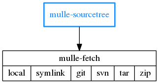
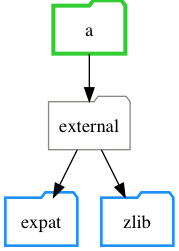

# mulle-sourcetree

🌲 Project composition and maintenance with build support


... for Linux, OS X, FreeBSD, Windows



Organize your projects freely with multiple archives and repositories.


#### Capabilities

* maintains local (file, folder) or external tree nodes (archive, repository)
* can inherit sourcetrees from dependencies
* can override external dependencies with symlinks to local projects
* supports the repair of the sourcetree after manual filesystem changes

#### What this enables you to do

* build sub-projects in the correct order
* build platform specifica without #ifdef or complicated Makefiles
* acquire dependencies unique to each platform
* maintain complex dependency trees


Executable          | Description
--------------------|--------------------------------
`mulle-sourcetree`  | Maintain sources and dependencies


## Install

See [mulle-sde-developer](//github.com/mulle-sde/mulle-sde-developer) how
to install mulle-sde.

On systems with `zsh` installed, mulle-sourcetree will run appreciably
faster.


## Sourcetree Nodes

A local sourcetree is a list of nodes. A node typically has a representation
in the filesystem. An easy example is a node called `zlib`, that is present
in the project as a folder called `zlib`.

A node consists of a of nine different fields. The most important fields are

* the address, which is its place in the project filesystem
* the nodetype, which distinguishes between local subprojects, remote repositories, operating system libraries and the like
* the url, which is used to identify and possibly retrieve a repository or archive for this node.

A node can also be decorated with various "marks" (see below) and can carry
a user-defined "userinfo" payload.

These are the fields of a node:

Field          | Required | Description
---------------|----------|---------------------------------------------
`address`      | YES      | name of the node and relative position in the project
`branch`       | NO       | repository branch (git)
`fetchoptions` | NO       | The node is not shareable with other sourcetrees
`marks`        | NO       | marks of the node
`nodetype`     | YES      | type of node
`tag`          | NO       | tag (git/github archive)
`url`          | NO       | URL of node.
`userinfo`     | NO       | userinfo of node. can be binary.
`uuid`         | NO       | internal node identifier. Don't touch, don't copy!


The fields "nodetype", "branch", tag", "url", "fetchinfo" are expandable.
Which means that environment variables can affect their contents. The expansion
order is "branch" and "tag", then "url" and finally "fetchinfo". The expanded
contents are available through the following environment variables:

Variable                  | Description
--------------------------|-------------------------------------
`MULLE_BRANCH`            | expanded contents of "branch"
`MULLE_TAG`               | expanded contents of "tag"
`MULLE_TAG_OR_BRANCH`     | expanded contents of "tag" or if empty of "branch"
`MULLE_URL`               | expanded contents of "url"

You can thus override project versions and URLs of inherited dependencies, if
they participate in this scheme. This allows you to substitute github release
URLs with some intermediate testing ones for instance.


This is the canonical way to specify a sourcetree dependency in mulle-sde.
It allows you to override the version (ZLIB_TAG) and the host of the archive
(ZLIB_URL) to download the desired archive.

```
mulle-sourcetree add \
   --nodetype tar \
   --tag '${ZLIB_TAG:-2.0.0}' \
   --url '${ZLIB_URL:-https://github.com/madler/zlib/archive/${MULLE_TAG}.tar.gz}' \
   external/zlib
```


## Sourcetree Nodetypes

These are the known nodetypes. In addition to `address` and `nodetype` some
of the other fields may be used or ignored, depending on the nodetype.

Nodetype  | Url | Branch | Tag | Fetchoptions | Description
----------|-----|--------|-----|--------------|------------------------
`git`     | YES | YES    | YES | YES          | git repository
`local`   | NO  | NO     | NO  | NO           | used for subprojects
`svn`     | YES | YES    | NO  | YES          | svn repository
`symlink` | YES | NO     | NO  | NO           | symbolic link
`tar`     | YES | NO     | YES | YES          | tar archive. fetchoptions enable check shasum integrity
`zip`     | YES | NO     | YES | YES          | zip archive. fetchoptions enable check shasum integrity

> `zip` and `tar` use the tag through expansion (see above). If the URL isn't
> properly fashioned, setting the tag will have no affect.


## Sourcetree Marks

A node of a sourcetree can have a variety of pre-defined and user-defined
"marks". These are a list of marks that are interpreted by mulle-sourcetree.
By default a node has all possible marks. You can selectively remove marks.

Mark       | Description
-----------|---------------------------------------------
`delete`   | Will be deleted in a `mulle-sourcetree clean`
`fs`       | The node has/should have a corresponding  file or folder
`recurse`  | An inferior sourcetree within this node will be used
`require`  | Failure to fetch this node is an error.
`set`      | The node itself can be modified.
`share`    | The node is shareable with other sourcetrees
`update`   | The node will be updated after an initial fetch.

These are some marks, that are used by mulle-sde tools:


Mark           | Description
---------------|---------------------------------------------
`all-load`     | Will be linked "wholesale" for Objective-C
`build`        | Will be built.
`cmakeinherit` | Participates in cmake dependency inclusion scheme
`dependency`   | This is a dependency
`header`       | Will be used for header generation (_include-private.h)
`import`       | Will use `#import` instead of `#include` for header
`public`       | Is a public header (_include.h)
`link`         | Will be linked against

Mark                      | Description
--------------------------|---------------------------------------------
`cmake-add`               | Add to the list of libraries to link
`cmake-all-load`          | A library that needs all symbols (ObjC)
`cmake-dependency`        | Inherit foreign DependenciesAndLibraries.cmake
`cmake-inherit`           | Participate in cmake dependency inclusion scheme
`cmake-intermediate-link` | Prefixes generated container name with STARTUP_
`cmake-loader `           | Inherite foreign MulleObjCLoader for mulle-objc-loader-tool
`cmake-searchpath`        | Add include directory to searchpath (flattens headers)


#### Sourcetree Modes

Mode         | Description
-------------|---------------------------------------------
`--flat`     | Only the local sourcetree nodes are updated
`--recurse`  | Subtrees of nodes are also updated
`--share`    | Like recurse, but nodes with identical URLs are only fetched once

Generally you will use the `--share` - the default - for minimal hassle.


## Commands

#### `mulle-sourcetree add` : add nodes with

```
$ mulle-sourcetree add --url https://github.com/libexpat/libexpat/archive/R_2_2_5.tar.gz external/expat
```

You can specify your URL with environment variables, to make them more portable:

```
$ mulle-sourcetree add --url '${ZLIB_URL:-https://github.com/madler/zlib.git}' external/zlib
```


#### `mulle-sourcetree sync` : fetch and update nodes

After changing the sourcetree, run *sync* to reflect the changes back
into your project by fetching added and deleting removed dependencies:

```
$ mulle-sourcetree sync
```


#### `mulle-sourcetree list` : stay in control

See your sourcetree with **list**:

```
$ mulle-sourcetree list --output-header --output-eval
address         nodetype  marks  userinfo  url
-------         --------  -----  --------  ---
external/expat  tar                        https://github.com/libexpat/libexpat/archive/R_2_2_5.tar.gz
external/zlib   git                        https://github.com/madler/zlib.git
```

Use custom format options to retrieve the information you want. This example
lists all the URLs definitions used in your project:

```
mulle-sourcetree list -r --format "%u\n" --output-no-header --output-no-indent | sed -n 's/^\${\([A-Z_]*\):-\(.*\)}$/\1=\"\2\"/p' | sort -u
```

#### `mulle-sourcetree dotdump` : picture your sourcetree

Get a graphical overview with **dotdump**:

```
$ mulle-sourcetree dotdump > pic.dot
open pic.dot # view it with Graphviz (http://graphviz.org/)
```




#### `mulle-sourcetree craftorder` : retrieve projects to build

```
$ mulle-sourcetree craftorder
/private/tmp/a/external/expat
/private/tmp/a/external/zlib
```

## GitHub and Mulle kybernetiK

The development is done on
[Mulle kybernetiK](https://www.mulle-kybernetik.com/software/git/mulle-sourcetree/master).
Releases and bug-tracking are on
[GitHub](https://github.com/{{PUBLISHER}}/mulle-sourcetree).
