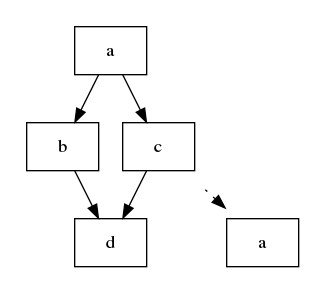
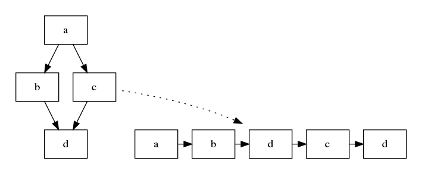
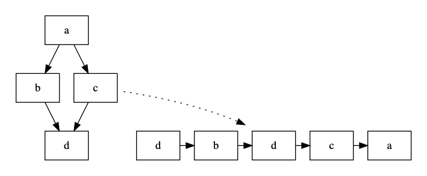
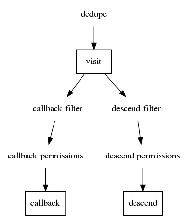

# Sourcetree walk modes

There are four different fundamental modes of walking the sourcetree

* flat
* in-order
* pre-order
* breadth-first

Lets introduce them first with some drawings.

> You can also read up on tree traversal in
> general more at [Geeksforgeeks: Tree Traversals](https://www.geeksforgeeks.org/tree-traversals-inorder-preorder-and-postorder/).

### Flat




Assume your sourcetree was built like this

`mulle-sourcetree add a`. The node **a** - when fetched - itself a sourcetree with **b** and **c**. Each **b** and **c** have themselves sourcetrees that refer to **d**.

A flat walk doesn't recurse, but stays in your project.

### Pre-order



The pre-order walker visits each node first, before descending into child nodes. This is probably
the most intuitive kind of recursion. Notice how **d** will be visited
twice, as it is a child node of **b** and also of **c**.

### In-order



The in-order walker descends into each nodes child nodes
first before actually visiting the node. This is for example useful to list the buildorder of nodes.


### Breadth-first


The breadth-first walker descends into each child node, after all sibling nodes (those in the same sourcetree)
have been visited.


## Examples

Create the filesystem structure:

```
mkdir a b c d
ln -s ../a a
ln -s ../b a/b
ln -s ../c a/c
ln -s ../d b/d
ln -s ../d c/d
```

Create the sourcetrees:

```
mulle-sourcetree -d a add b
mulle-sourcetree -d a add c
mulle-sourcetree -d b add d
mulle-sourcetree -d c add d
```

We need a "project", that holds the root sourcetree with the initial node **a**. This will be the base for our explorations:

```
mkdir project
cd project
mulle-sourcetree add a
ln -s ../a
```


Now walk the project in various modes:


```
mulle-sourcetree walk --flat 'echo "${MULLE_ADDRESS}"'
mulle-sourcetree walk --in-order 'echo "${MULLE_ADDRESS}"'
mulle-sourcetree walk --pre-order 'echo "${MULLE_ADDRESS}"'
mulle-sourcetree walk --breadth-first 'echo "${MULLE_ADDRESS}"'
```

## Deduplication of nodes

As you will have noticed the node **d** is visited twice during recursion.
This is rarely useful. In big sourcetrees, where lots of nodes are shared,
this can slow the proceedings down immensely.

Let's deduplicate based on the address:

```
mulle-sourcetree walk --dedupe address --pre-order 'echo "${MULLE_ADDRESS}"'
```

You will see that the second **d** has vanished from the output.


## Filtering of nodes

To explain filtering we need some terminology.

* callback     : at each node the walker may execute a callback. In the examples above the callback was the 'echo "${MULLE_ADDRESS}'
* descend      : the walker will read child nodes of a node, if it has a sourcetree
* visit a node : the walker is contemplating a callback or a descend

Depending on the mode, for each visited node the walker will have to descend
or callback first, as the following table shows. (Breadth-first will visit
twice)

Mode           | Visit #1          | Visit #2
---------------|-------------------|-----------------
flat           | callback          |
in-order       | descend, callback |
pre-order      | callback, descend |
breadth-first  | callback          | descend





Before each callback, the walker applies a **filter** and does a permission
check.

Before each descend, the walker applies a different **filter** and does a
permission check.

Filtering exlusively looks at the *marks* of a node. The filter is a
qualifier.

