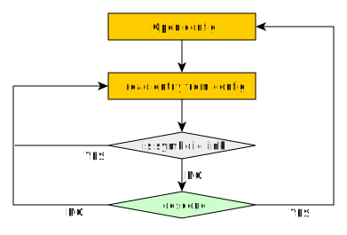
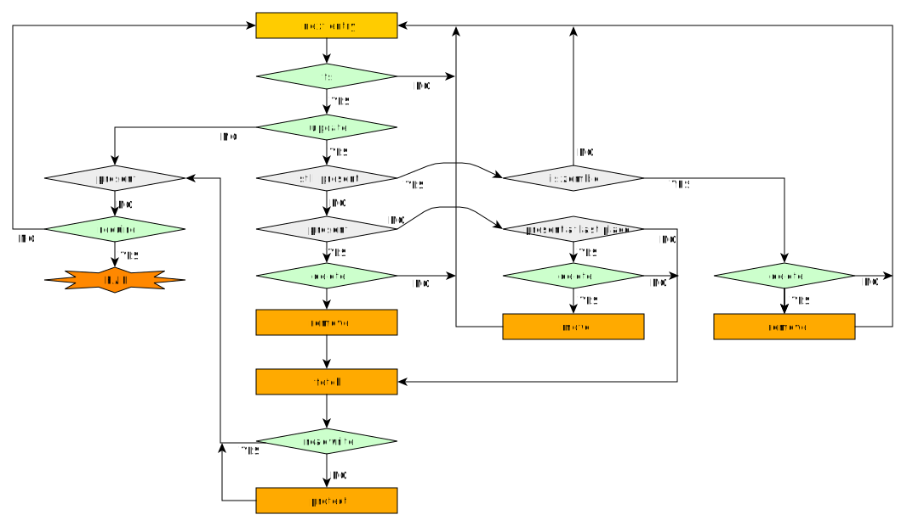
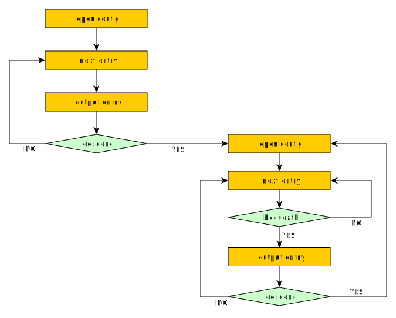

# Marks

Marks are used to control the behaviour of many of the mulle-sde programs. A mark is always implicitly defined, unless explicitly undefined in a dependency.

So as an example `descend` is always set, unless the dependency has the mark `no-descend`. Explicitly setting a mark to `descend` effectively only removes a possibly existing mark `no-descend`. If you make up your own mark say `whatever`, it will already be implicitly defined by all
entries!

With that being said, there also some explicit marks, that need to be set, to be defined. They invariable are prefixed with `only-`.

Marks are set or unset with the `mulle-sourcetree mark` and `mulle-sourcetree unmark` commands.

[[TOC]]

## mulle-sourcetree sync

The mulle-sourcetree **sync** synchronizes (fetches and unpacks) the projects dependencies. For this it has a **config** that contains **entries**. These are typically the dependencies of a project, but the sourcetree also manages libraries.

A sync happens in two stages. The initial read of the `config` file into an internal database is stage 1. In stage 2 the filesystem is compared with the contents of the database and fetches and deletions are affected.

### descend (sync)

[Stage 1] The `descend` mark controls recursion. A fetched dependency is checked for it's own sourcetree config. This config will then be read and it's entries handled as well.

### share

[Stage 1] A dependency marked `share` will be placed into the local **stash** folder. These dependencies are fetched only once, no matter how often they appear in the recursion (see [descend](#descend)).

A dependency marked `no-share` is placed into the project at the *address* of the dependency.

### fs

[Stage 2] A config entry marked `no-fs` does not take part in the actual sync.
This is useful for system library entries or entries that are used for other
non-sync purposes.

The `fs` is the very first mark being checked during stage 2.

> In the diagram "database entries" are read. Deleted dependencies will still
> have a database entry. This way a sync can detect and remove these zombies.
>
### readwrite

[Stage 2] A dependency marked `no-readwrite` will be write protected. Write
protecting embedded files can be useful to prevent accidental edits, that would
be lost after the next cleaning operation.

### delete

[Stage 2] A dependency marked `no-delete` can not be deleted or moved by the
sync. So an entry marked `no-delete` acts as a one-time fetch. It's also used
for system libraries and subprojects.

### update

[Stage 2] A dependency marked `no-update` does not take part in the sync
process. It is mostly used for subprojects, which are expected to be there
already.

### require

[Stage 2] If a dependency marked `require` can not be fetched, the sync will
fail. The mark `no-require` can be Operating System specific. For example
`no-require-os-linux` would make a dependency required on all systems except
linux.

## mulle-sourcetree walk

The **walk** is used to traverse the fetched dependencies to generate
the necessary information to build the dependencies in the proper order and to
link what needs to be linked.

### descend (walk)

With `descend` you can stop the recursion for any entry during a walk.

### bequeath

With `no-bequeath` you can stop the recursion for any entry that is not
appearing in the top most config. Most often used for dependencies that are
executables or startup libraries. An executable that provides tooling for the
build, may use a certain library, that isn't needed for the actual build
output. Marking those dependencies as `no-bequeath` in the config of the executable project will do the trick.

## mulle-sourcetree craftorder

This command is used to create craftorder files

### only-platform-...
### no-platform-...

### version-min-...
### version-max-...

## mulle-sde linkorder

The linkorder emits the link statements necessary to link the project.

### static-link

Set dependencies to `no-static-link` if they are created as dynamic (shared)
libraries. Used by `mulle-test`.

### only-standalone (linkorder)

See the **mulle-craft** explanation for [`only-standalone`](only-standalone).

### dependency

Entries marked `no-dependency` do not partake in the linkorder output, if they
are part of a `no-static-link` or `only-standalone` agglomeration.

### only-standalone

### no-intermediate-link

### no-dynamic-link

A dependency or library marked no-dynamic-link can only be statically linked.
(What's the difference to only-static-link ?)

### no-static-link

### no-actual-link

## mulle-craft project/craftorder

These are the commands to build the project and the
dependencies. They share the same set of marks.

### build

Partake in the build. Embedded dependencies that are build by the mainproject will have `no-build` set.

### singlephase

Forces serial compilation of this dependency. If marked as `no-singlephase` dependencies are built with the mulle specific three-phase build, which allows multiple dependency builds to be done in parallel.

### memo

A specialized flag used at some time for subprojects. If `no-memo` is set, it adds command line flags provided by the `--no-memo-makeflags` and removes subprojects from the status output of mulle-craft.
(deprecated/obsolete)

### only-standalone

A special positive marker. This marks a, usually dynamic, library as a standalone library. Such a standalone library is an agglomeration of multiple single libraries (legacy)

### dependency

Only entries marked `dependency` will be built. An entry marked `no-dependency` will result in failure.

### require

A dependency marked `no-require` need not exist and its absence or failure to build will not preempt the craft.

### only-platform-...

Matches the platform to be built, not the operating system being build on. Example: you are on `darwin` (OS) but want to build for `iphoneos` (platform).

### no-platform-...

Like the `no-platform-` counterpart but it matches the platform to be built.

### only-sdk-...

Like the `only-platform-` counterpart but it matches the SDK to be built with.

### no-sdk-...

Like the `no-platform-` counterpart but it matches the SDK to be built.

### inplace

Inplace builds forego the **dispense** phase. If set, the install of a dependency is made directly to the **dependency** folder, instead of using **dispense** to copy or move products.

### all-load

A dependency marked `all-load` (usually an Objective-C library) needs to be linked in a special way, so that no symbols are optimised away during link.

### only-standalone

### no-intermediate-link

### no-dynamic-link

Force extension to be produced static

### no-static-link

Force extension to be produced dynamic

## mulle-craft dispense

The dispense operation of **mulle-craft** copies headers, libraries and other build products from the **kitchen** to the **dependency** folder. It only happens for dependencies marked with `no-inplace`.

### rootheader

With `no-rootheader` a subdirectory is created in **dependency/include** and header files are installed there.

### only-liftheaders

If set, header files are moved up one directory level from their subdirectories.

## mulle-sourcetree-to-c

This program is used to generate header files in the `src/reflect` folder. These files are self-documenting in the way marks are used to tweak their content. So check out the produced header files.

Used marks are

* `all-load`
* `cmake-dependency`
* `cmake-loader`
* `cmake-searchpath`
* `no-platform-`...
* `only-platform-`...
* `import`
* `public`
* `require`
* `header`

## mulle-sourcetree-to-cmake

This program is used to generate cmake files in the `cmake/reflect` folder. These files are self-documenting in the way marks are used to tweak the content. So check out the produced cmake files.

Used marks are

* `all-load`
* `cmake-dependency`
* `cmake-loader`
* `cmake-searchpath`
* `no-platform-`...
* `only-platform-`...
