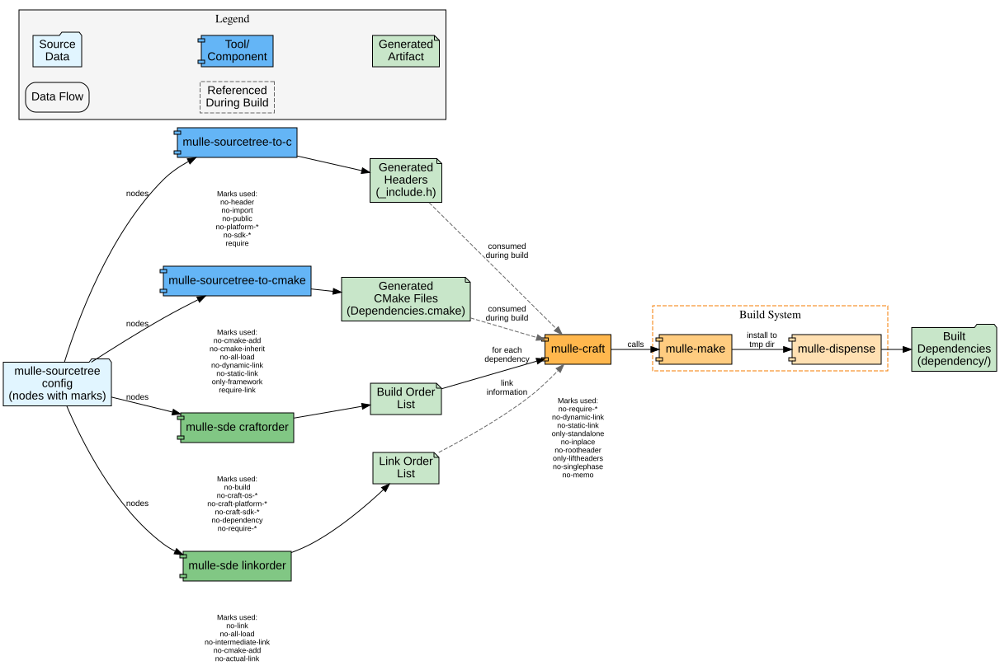

# mulle-sde Craft Pipeline: Mark Usage Matrix

This document shows which marks are used by each tool in the mulle-sde craft pipeline.

## Pipeline Overview



> The diagram above shows how marks flow through the pipeline from sourcetree config to built dependencies.

## Mark Usage by Tool

### Legend
- ✓ = Mark is checked/used by this tool
- ⚠️ = Mark influences behavior but may be checked by called tool
- — = Not used by this tool

| Mark | to-c | to-cmake | craftorder | linkorder | craft | Description |
|------|------|----------|------------|-----------|-------|-------------|
| **Build Control** |
| `no-build` | — | — | ✓ | — | — | Exclude from craftorder |
| `no-dependency` | — | — | ✓ | — | ✓ | Skip if `--no-dependency` flag set |
| `no-mainproject` | — | — | — | — | ✓ | Marks as subproject (internal use) |
| `no-memo` | — | — | — | — | ✓ | Don't record build result |
| `no-singlephase` | — | — | — | — | ✓ | Enable parallel build phases |
| **Platform Filtering** |
| `no-platform-<os>` | ✓ | ✓ | — | — | — | Platform-specific inclusion |
| `no-craft-platform-<os>` | — | — | ✓ | — | — | Don't build for platform |
| `no-sdk-<os>` | ✓ | ✓ | — | — | — | SDK-specific inclusion |
| `no-craft-sdk-<sdk>` | — | — | ✓ | — | — | Don't build for SDK |
| `no-craft-os-<os>` | — | — | ✓ | — | — | Don't build on host OS |
| `only-craft-release` | — | — | ✓ | — | — | Force Release configuration |
| **Requirements** |
| `require` | ✓ | — | — | — | — | Header must exist |
| `require-link` | — | ✓ | — | — | — | Library must exist |
| `no-require` | — | — | ✓ | — | ✓ | Ignore if source missing |
| `no-require-os-<os>` | — | — | ✓ | — | ✓ | Not required on OS |
| `no-require-platform-<p>` | — | — | ✓ | — | ✓ | Not required for platform |
| `no-require-sdk-<sdk>` | — | — | ✓ | — | ✓ | Not required for SDK |
| `no-require-configuration-<c>` | — | — | ✓ | — | ✓ | Not required for config |
| **Header Generation** |
| `no-header` | ✓ | — | — | — | — | Don't generate include |
| `no-import` | ✓ | — | — | — | — | Use `#include` not `#import` |
| `no-public` | ✓ | — | — | — | — | Not in public header |
| **CMake Generation** |
| `no-cmake-add` | — | ✓ | — | ✓ | — | Don't add to link list |
| `no-cmake-inherit` | — | ✓ | — | — | — | Don't inherit definitions |
| `no-cmake-loader` | — | ✓ | — | — | — | Don't inherit loader |
| `no-cmake-searchpath` | — | ✓ | — | — | — | Don't add to search path |
| `no-cmake-all-load` | — | ✓ | — | — | — | Don't force all-load |
| `no-cmake-intermediate-link` | — | ✓ | — | — | — | Don't prefix with STARTUP_ |
| `no-cmake-suppress-system-path` | — | ✓ | — | — | — | Allow system path search |
| **Linking** |
| `no-link` | — | — | — | ✓ | — | Exclude from linkorder |
| `no-actual-link` | — | — | — | ✓ | — | Not actually linked |
| `no-intermediate-link` | — | ✓ | — | ✓ | — | Not linked as startup lib |
| `no-all-load` | — | ✓ | — | ✓ | ✓ | Don't load all symbols |
| `no-dynamic-link` | — | ✓ | — | — | ✓ | Force static library |
| `no-static-link` | — | ✓ | — | — | ✓ | Force dynamic library |
| `only-framework` | — | ✓ | — | — | ✓ | Build as framework |
| `only-standalone` | — | — | — | — | ✓ | Build standalone library |
| **Dispense/Install** |
| `no-inplace` | — | — | — | — | ✓ | Build in temp, then dispense |
| `no-rootheader` | — | — | — | — | ✓ | Install headers in subdir |
| `only-liftheaders` | — | — | — | — | ✓ | Lift headers up one level |

## Tool-Specific Mark Groups

### mulle-sourcetree-to-c
Generates header include statements (e.g., `_include.h`, `_include-private.h`)

**Primary Marks:**
- `no-header` - Skip this node
- `no-import` - Use `#include` instead of `#import`
- `no-public` - Don't include in public header
- `require` - Wrap with `#if __has_include`
- `no-platform-*` / `no-sdk-*` - Generate platform-specific `#ifdef`

**Output:** C/Objective-C header files

### mulle-sourcetree-to-cmake
Generates CMake dependency and library definitions

**Primary Marks:**
- `no-cmake-add` - Don't add to library list
- `no-cmake-inherit` - Don't inherit `DependenciesAndLibraries.cmake`
- `no-all-load` - Use regular linking (not whole-archive)
- `no-dynamic-link` / `no-static-link` - Control `find_library` search
- `require-link` - Fail if library not found

**Output:** CMake include files (`Dependencies.cmake`, `DependenciesAndLibraries.cmake`)

### mulle-sde craftorder
Determines dependency build order

**Primary Marks:**
- `no-build` - Completely exclude from build
- `no-craft-os-*` / `no-craft-platform-*` / `no-craft-sdk-*` - Platform filtering
- `no-require-*` - Allow missing dependencies
- `no-dependency` - Skip if `--no-dependency` specified
- `only-craft-release` - Force Release configuration

**Output:** List of dependency directories in build order

### mulle-sde linkorder
Determines library link order

**Primary Marks:**
- `no-link` - Exclude from link list
- `no-cmake-add` - Don't add to link libraries
- `no-all-load` - Normal linking
- `no-intermediate-link` - Not a startup library
- `no-actual-link` - Present but not linked

**Output:** List of libraries in link order

### mulle-craft
Builds dependencies using mulle-make

**Primary Marks:**
- `no-require-*` - Don't fail if missing
- `no-dynamic-link` / `no-static-link` - Library style (`--library-style`)
- `only-standalone` - Build standalone library
- `no-inplace` - Build in tmp, then dispense
- `no-rootheader` - Header install location
- `only-liftheaders` - Lift headers during dispense
- `no-singlephase` - Enable parallel phases
- `no-memo` - Don't cache build result

**Output:** Built libraries and headers in `dependency/` directory

## Mark Semantic

Most marks use a "disable" semantic:
- **Default:** All capabilities enabled
- **`no-*` prefix:** Removes/disables the capability
- **`only-*` prefix:** Forces a specific mode (overrides defaults)
- **Platform/OS suffixes:** Makes mark conditional (`no-platform-linux`, `no-sdk-macosx`)

## Cross-Tool Mark Flow

Some marks affect multiple tools in the pipeline:

### `no-all-load`
- **to-cmake:** Don't emit whole-archive flags
- **linkorder:** Don't mark for special linking
- **craft:** Pass to mulle-make for library style

### `no-require-*` family
- **craftorder:** Allow missing source directory
- **craft:** Don't fail if dependency can't be built

### `no-platform-*` / `no-sdk-*`
- **to-c:** Generate platform-specific `#ifdef`
- **to-cmake:** Generate platform-specific cmake
- **craftorder:** (uses `no-craft-platform-*` variant)

### `no-dynamic-link` / `no-static-link`
- **to-cmake:** Control `find_library` search
- **craft:** Pass `--library-style` to mulle-make

## Typical Mark Combinations

### Header-Only Library
```
marks: no-build,no-link,header
```
Generate includes, don't build or link.

### Platform-Specific Dependency
```
marks: no-craft-platform-linux,no-require-platform-linux
```
Don't build on Linux, don't fail if missing on Linux.

### Objective-C Framework (macOS)
```
marks: only-framework,no-all-load
```
Build as framework, use loader instead of whole-archive.

### Static-Only Library
```
marks: no-dynamic-link
```
Never search for or build as shared library.

### Development/Debug Dependency
```
marks: no-build,no-link,no-craft-release
```
Don't include in release builds.

## Source Files

Mark checking is implemented in:
- `mulle-sourcetree-to-c` - src/mulle-sourcetree-to-c.sh
- `mulle-sourcetree-to-cmake` - src/mulle-sourcetree-to-cmake.sh
- `mulle-sde` craftorder/linkorder - See mulle-sde repository
- `mulle-craft` - src/mulle-craft-qualifier.sh, src/mulle-craft-build.sh

## Mark Definition Files

Complete mark definitions with descriptions:
- `mulle-sourcetree-marks.json` - Sync/fetch marks
- `mulle-sourcetree-to-c-marks.json` - Header generation marks
- `mulle-sourcetree-to-cmake-marks.json` - CMake generation marks
- `mulle-craft-marks.json` - Build marks

## Related Documentation

- `mulle-sourcetree-sync-marks-flow.md` - How marks control sync/fetch
- `mulle-sde-craft-pipeline.svg` - Pipeline architecture diagram
- `mulle-craft-build-flow.md` - mulle-craft build decision logic (if created)
