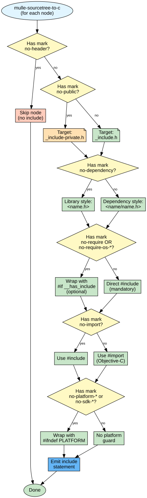
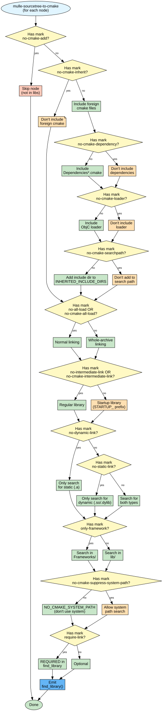
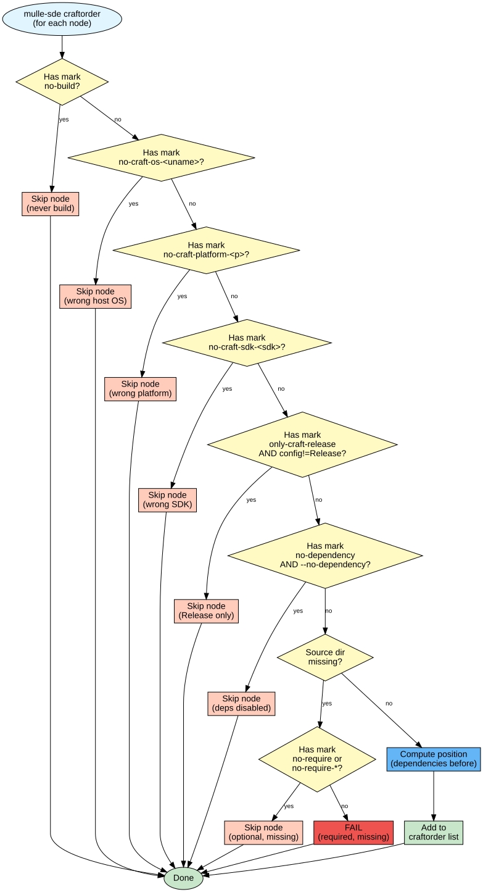
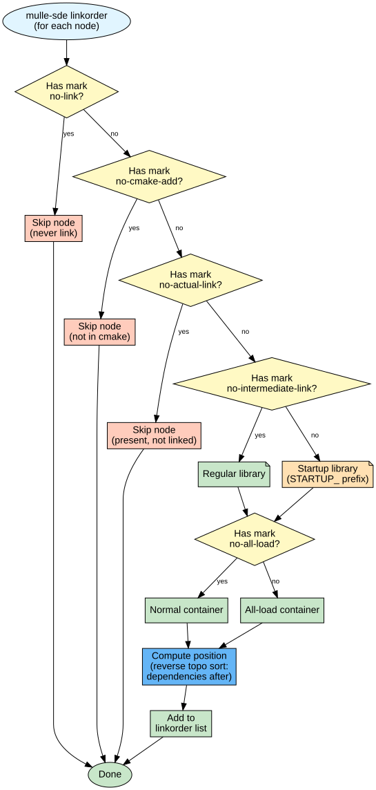
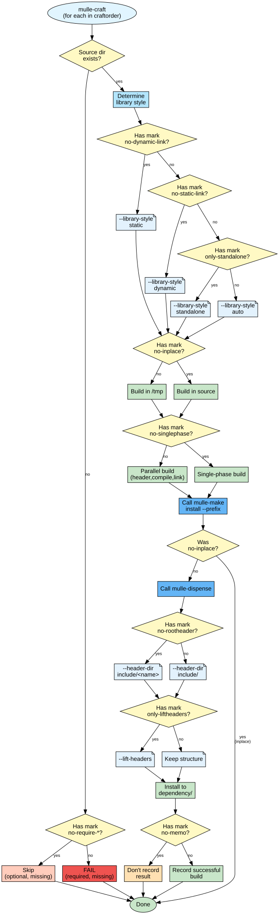
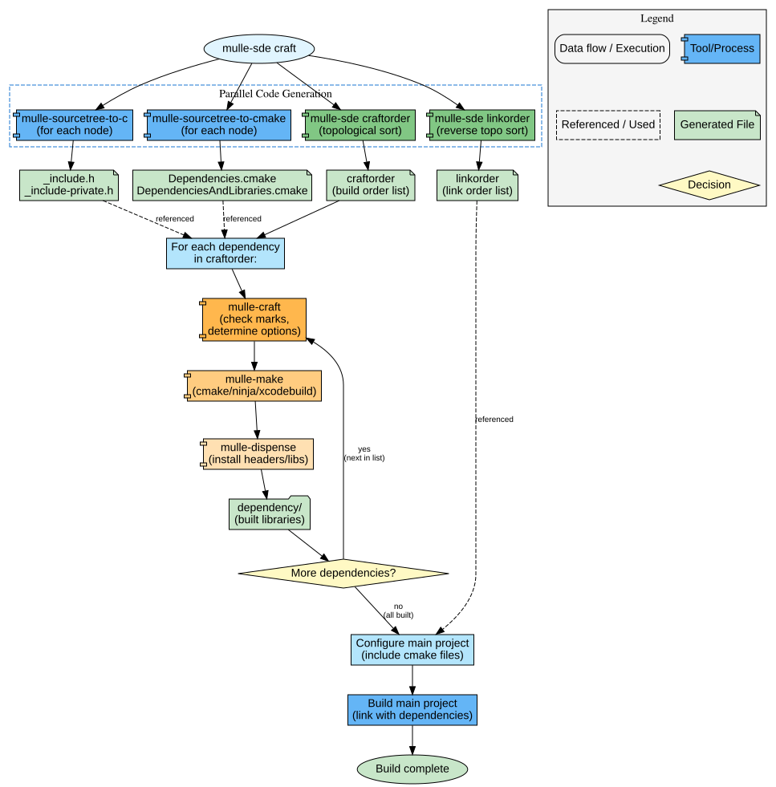

# mulle-sde Craft Pipeline: Complete Walkthrough

This document explains how dependencies flow through the mulle-sde craft pipeline, with detailed flowcharts for each stage.

## Pipeline Overview


The craft pipeline processes sourcetree nodes through multiple tools to generate code artifacts and build dependencies. Each tool examines node marks and makes decisions about what to generate or build.

---

## Mark Semantics: Important!

**All marks are implicitly present by default.** Marks use a "disable" semantic:

- **Default state:** Every capability is enabled (build, link, header, etc.)
- **`no-*` prefix:** Explicitly disables a capability
- **`only-*` prefix:** Forces a specific mode

**Example:**
```
# These marks are shown:
no-header,no-all-load

# These marks are implicit (not shown):
build,link,update,fetch,share,require,...
```

When viewing sourcetree configs, you only see marks that **disable** or **force** behavior. This keeps configs concise and 
future proof.

---

## Stage 1: mulle-sourcetree-to-c (Header Generation)

### Purpose
Generate C/Objective-C include statements for dependencies.

### Decision Flow



### Input Example
```
Node: zlib
Marks: no-header
```

### Output Example
```c
// src/reflect/_include.h (generated)
// (zlib not included - has no-header mark)

// src/reflect/_include-private.h (generated)  
// (zlib not included - has no-header mark)
```

### Key Marks
- `no-header` - Skip completely
- `no-public` - Private header only
- `no-import` - Use #include not #import
- `require` - Don't wrap with __has_include
- `no-platform-*`, `no-sdk-*` - Add platform guards

---

## Stage 2: mulle-sourcetree-to-cmake (CMake Generation)

### Purpose
Generate CMake `find_library()` commands and dependency includes.

### Decision Flow



### Input Example
```
Node: zlib
Marks: no-all-load
```

### Output Example
```cmake
# cmake/reflect/Dependencies.cmake (generated)
if( NOT ZLIB_LIBRARY)
   find_library( ZLIB_LIBRARY NAMES z
                 HINTS "${DEPENDENCY_DIR}/lib"
                 NO_CMAKE_SYSTEM_PATH)
endif()

# cmake/reflect/DependenciesAndLibraries.cmake (generated)
if( ZLIB_LIBRARY)
   list( INSERT DEPENDENCY_LIBRARIES 0 ${ZLIB_LIBRARY})
endif()
```

### Key Marks
- `no-cmake-add` - Skip completely
- `no-all-load` - Normal linking (not whole-archive)
- `no-dynamic-link` / `no-static-link` - Library type preference
- `only-framework` - Framework search
- `require-link` - Mandatory library

---

## Stage 3: mulle-sde craftorder (Build Order)

### Purpose
Determine the order in which dependencies must be built.

### Decision Flow



### Input Example
```
Node: zlib
Source: dependency/stash/zlib/
```

### Output Example
```
# craftorder output (one path per line)
dependency/stash/mulle-c11
dependency/stash/zlib
dependency/stash/mylib
```

### Key Marks
- `no-build` - Never build
- `no-craft-os-*`, `no-craft-platform-*`, `no-craft-sdk-*` - Platform filtering
- `only-craft-release` - Only in Release config
- `no-dependency` - Skip with `--no-dependency`
- `no-require-*` - Allow missing source

---

## Stage 4: mulle-sde linkorder (Link Order)

### Purpose
Determine the order in which libraries must be linked (reverse of build order).

### Decision Flow



### Input Example
```
Node: zlib
```

### Output Example
```
# linkorder output (special format)
STARTUP__
mylib
_
zlib
```

Format:
- `STARTUP__` marks startup libraries
- `_` separates startup from regular libs
- Dependencies appear AFTER dependents (reverse of craftorder)

### Key Marks
- `no-link` - Never link
- `no-cmake-add` - Not in link list
- `no-actual-link` - Skip actual linking
- `no-intermediate-link` - Not a startup lib
- `no-all-load` - Normal linking

---

## Stage 5: mulle-craft (Build Execution)

### Purpose
Build each dependency from craftorder using mulle-make.

### Decision Flow



### Input Example
```
Entry: dependency/stash/zlib
Marks: no-all-load
```

### Output Example
```
# Build happens:
cd dependency/stash/zlib
mulle-make install --prefix /tmp/mulle-craft.XyZ9

# Dispense happens:
mulle-dispense /tmp/mulle-craft.XyZ9 dependency/Release

# Result:
dependency/Release/
├── include/
│   └── zlib.h
└── lib/
    └── libz.a
```

### Key Marks
- `no-require-*` - Don't fail if missing
- `no-dynamic-link` / `no-static-link` / `only-standalone` - Library style
- `no-inplace` - Build location
- `no-rootheader` - Header subdirectory
- `only-liftheaders` - Lift headers
- `no-singlephase` - Parallel build
- `no-memo` - Don't cache result

---

## Stage 6: Main Project Build

### Purpose
Link main project against built dependencies using generated CMake files.

### Process

```
cmake configure:
    │
    ├─> include( cmake/reflect/Dependencies.cmake)
    │   └─> Sets ZLIB_LIBRARY, MYLIB_LIBRARY, etc.
    │
    ├─> include( cmake/reflect/DependenciesAndLibraries.cmake)
    │   └─> Populates DEPENDENCY_LIBRARIES list
    │
    └─> target_link_libraries( my_project ${DEPENDENCY_LIBRARIES})
        └─> Links in correct order from linkorder
```

---

## Complete Flow Diagram



The diagram above shows the complete execution flow from `mulle-sde craft` through all stages to the final built project.

---

## Example Run: Single Dependency

Let's trace one dependency through the complete pipeline:

### Initial Configuration
```
Address:  zlib
URL:      https://github.com/madler/zlib/archive/1.2.11.tar.gz
Nodetype: tar
Marks:    no-header,no-all-load
```

**Note:** Marks `share` and `update` are implicit (always enabled by default) so not shown. Only `no-header` and `no-all-load` are explicit.

### to-c Stage
- Check `no-header`: YES → **Skip** (no include generated)

### to-cmake Stage
- Check `no-cmake-add`: NO → Include
- Check `no-all-load`: YES → Normal linking
- **Output:** `find_library( ZLIB_LIBRARY NAMES z )`

### craftorder Stage
- Check `no-build`: NO → Include
- Check platform/os/sdk marks: None → Include
- Check source exists: YES → Include
- **Output:** `dependency/stash/zlib` in build list

### linkorder Stage
- Check `no-link`: NO → Include
- Check `no-cmake-add`: NO → Include
- **Output:** `zlib` in link list (after dependents)

### craft Stage
- Check source exists: YES → Build
- Check `no-dynamic-link`: NO → Auto library style
- Check `no-inplace`: NO → Build in tmp, dispense
- **Execute:** Build libz.a, install to `dependency/Release/lib/libz.a`

### Main Project
- CMake includes `Dependencies.cmake` → finds `libz.a`
- Links main project with `${DEPENDENCY_LIBRARIES}`
- **Result:** Successfully linked

---

## Debugging Common Issues

### Dependency not in craftorder?
Check these marks in sequence:
1. `no-build` → Never builds
2. `no-craft-os-<os>` → Filtered by host OS
3. `no-craft-platform-<p>` → Filtered by target platform
4. `no-craft-sdk-<sdk>` → Filtered by SDK
5. `only-craft-release` + Debug config → Release only
6. `no-require` + missing source → Skipped gracefully

### Dependency not in linkorder?
Check these marks:
1. `no-link` → Never links
2. `no-cmake-add` → Not in CMake libs
3. `no-actual-link` → Present but not linked

### Include not generated?
Check these marks:
1. `no-header` → No include generated
2. `no-public` → Only in private header
3. Platform guards may hide it on current platform

### CMake can't find library?
Check these:
1. `no-cmake-add` → Not in library list
2. Dependency not built (check craftorder)
3. Wrong library type (check `no-dynamic-link`/`no-static-link`)

---

## Related Documentation

- `mulle-sde-craft-pipeline.svg` - Visual pipeline architecture
- `mulle-sde-craft-marks-matrix.md` - Complete mark reference table
- `mulle-sourcetree-sync-marks-flow.md` - How marks control fetch/sync
- `mulle-craft-marks.json` - Build mark definitions
