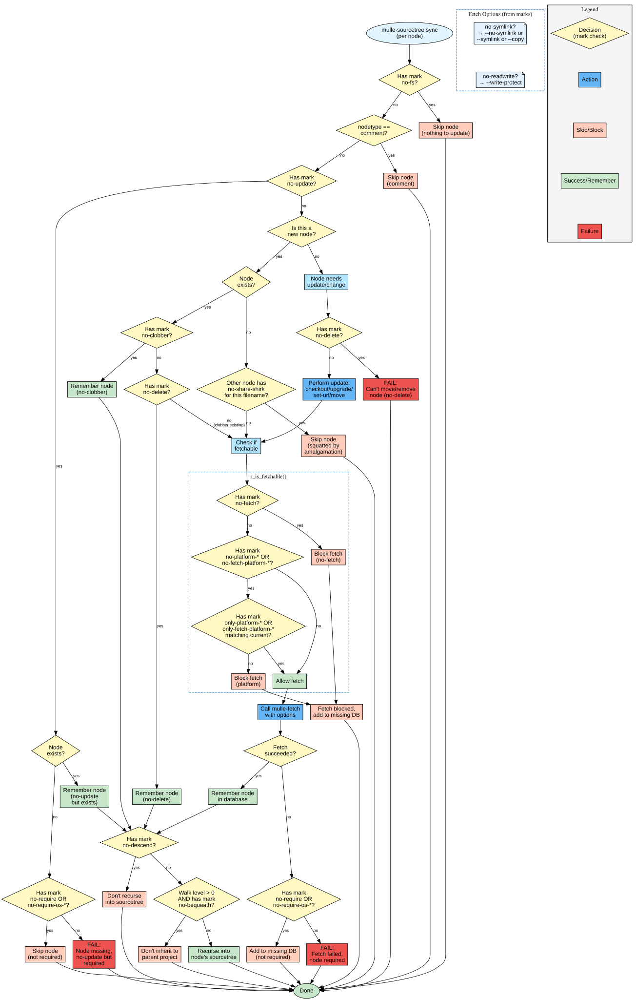

# mulle-sourcetree Sync: How Marks Control Fetch Behavior

This document explains how various marks influence the sync/fetch process during `mulle-sourcetree sync`.



> The flowchart above shows the complete decision tree for processing each node during sync.
> Follow the flow from top to bottom to understand how marks affect whether a node is
> fetched, updated, skipped, or causes the sync to fail.

## Mark Categories

The following sections explain the different marks shown in the flowchart above.
Each mark corresponds to a decision point (yellow diamond) or affects the options
passed to mulle-fetch (blue boxes).

### 1. Marks that Skip Nodes Entirely

These marks cause a node to be completely skipped during sync (see the top-left paths in the flowchart):

| Mark | Effect |
|------|--------|
| `no-fs` | Node has no filesystem representation; skip all update logic |
| `comment` nodetype | Not a mark, but comment nodes are always skipped |

### 2. Marks that Control Update Behavior

| Mark | Effect | In Flowchart |
|------|--------|--------------|
| `no-update` | Node will not be updated; if exists → remember it; if missing and required → fail | First major decision after `no-fs` check |

### 3. Marks that Control Fetch Blocking

These marks determine whether a node can be fetched at all (see the `r_is_fetchable()` cluster in the flowchart):

| Mark | Effect |
|------|--------|
| `no-fetch` | Completely blocks fetching |
| `no-platform-<os>` | Blocks fetch on specific host platform (e.g., `no-platform-darwin`) |
| `no-fetch-platform-<os>` | Blocks fetch for specific target platform |
| `only-platform-<os>` | Only fetch if platform matches (overrides `no-platform-*`) |
| `only-fetch-platform-<os>` | Only fetch if fetch platform matches |

### 4. Marks that Control Fetch Options

These marks modify how `mulle-fetch` is called (see the "Fetch Options" cluster in the flowchart):

| Mark | Fetch Option | Effect |
|------|--------------|--------|
| `no-symlink` | `--no-symlink` | Force copy instead of symlink |
| `symlink-<os>` | Platform-specific | Control symlink behavior per OS |
| `no-readwrite` | `--write-protect` | Make fetched content read-only |

### 5. Marks that Control Error Handling

These marks determine whether failures are fatal (see the decision points after fetch operations):

| Mark | Effect | In Flowchart |
|------|--------|--------------|
| `no-require` | If fetch fails or node is missing, don't fail the sync | Checked after fetch failure and when `no-update` nodes are missing |
| `no-require-os-<os>` | Not required on specific host OS (e.g., `no-require-os-linux`) | Same as above, OS-specific |

### 6. Marks that Control Deletion/Movement

These marks protect nodes from being modified (see the "Update/change" section and "New node" handling):

| Mark | Effect | In Flowchart |
|------|--------|--------------|
| `no-delete` | Node cannot be deleted or moved during sync | Checked in multiple places: new nodes, update operations |
| `no-clobber` | Don't overwrite existing files when node is new | Checked when new node but file already exists |

### 7. Marks that Control Recursion

| Mark | Effect | In Flowchart |
|------|--------|--------------|
| `no-descend` | Don't recurse into this node's sourcetree | First check at bottom of flow before completion |
| `no-bequeath` | When walking recursively (level > 0), don't inherit this node to parent project | Second check after `no-descend`, before actual recursion |
| `no-bequeath-os-<os>` | Don't bequeath on specific OS (e.g., `no-bequeath-os-darwin`) | Same as above, OS-specific |

### 8. Marks that Control Sharing and Squatting

| Mark | Effect |
|------|--------|
| `share` | Node is placed in shared stash directory |
| `no-share` | Node is not shared |
| `no-share-shirk` | Node is an amalgamation that "squats" space, preventing other nodes from using it |
| `basename` | Compare nodes by basename instead of full address |

## How to Read the Flowchart

The flowchart uses the following visual language:
- **Yellow diamonds** = Decision points where marks are checked
- **Blue boxes** = Actions or operations performed
- **Orange boxes** = Node is skipped or fetch is blocked (non-fatal)
- **Green boxes** = Success outcomes (node remembered in database)
- **Red boxes** = Fatal errors that stop the sync
- **Ellipses** = Start and end points

Follow the arrows from "mulle-sourcetree sync" at the top. At each diamond, the
flow branches based on whether the mark is present ("yes") or absent ("no").

## Sync Flow Summary

For each node in the sourcetree config, the following steps are performed (trace through the flowchart):

1. **Early Exits**
   - `no-fs` → skip
   - `comment` nodetype → skip
   - `no-update` + exists → remember and optionally descend
   - `no-update` + missing + `no-require` → skip
   - `no-update` + missing + required → **FAIL**

2. **New Node Handling**
   - If node doesn't exist in database but file exists:
     - `no-clobber` → just remember it
     - `no-delete` → just remember it
     - Otherwise → clobber and fetch
   - If squatted by amalgamation → skip

3. **Fetchability Check** (`r_is_fetchable`)
   - `no-fetch` → block
   - `no-platform-*` or `no-fetch-platform-*` → block (unless `only-platform-*` matches)
   - Otherwise → allow

4. **Fetch Operation**
   - Call `mulle-fetch` with options determined by marks
   - On success → remember in database
   - On failure:
     - `no-require` or `no-require-os-*` → add to missing DB
     - Otherwise → **FAIL**

5. **Update/Change Operations**
   - If node needs update/move:
     - `no-delete` → **FAIL** (can't move/remove)
     - Otherwise → perform update, then fetch

6. **Recursion**
   - `no-descend` → don't recurse
   - If walk level > 0 (recursed) and `no-bequeath` → don't inherit to parent
   - Otherwise → recurse into node's sourcetree

## Common Mark Combinations

### Optional System Dependency
```
marks: no-require,no-fs
```
Node is optional and has no filesystem representation (e.g., system library).

### Local Development Override
```
marks: no-update,no-delete
```
Prevent sync from touching a local development copy.

### Platform-Specific Dependency
```
marks: no-platform-linux,no-require-os-linux
```
Not needed on Linux, don't fail if missing on Linux.

### Shared Dependency
```
marks: share,update
```
Place in shared stash, update on sync.

### Amalgamated Dependency
```
marks: no-share,no-share-shirk
```
Embedded in parent, prevents shared node from being fetched.

### Non-Bequeathed Dependency
```
marks: no-bequeath
```
Dependency is only visible to the immediate project, not inherited by parent projects.
Useful for: build tools, test frameworks, or other dependencies that shouldn't propagate up the dependency chain.

Example: Project A depends on B, B depends on C. If C is marked `no-bequeath` in B's sourcetree, then A won't see C.

## Implementation Notes

- The actual mark checking is done in `src/mulle-sourcetree-action.sh`
- Key functions:
  - `sourcetree::action::r_is_fetchable()` - checks fetch-blocking marks
  - `sourcetree::action::r_fetch_eval_options()` - converts marks to fetch options
  - `sourcetree::action::r_update_actions_for_node()` - determines what actions to take
- Marks use a "disable" semantic: nodes have all marks by default, `no-*` marks remove them
- `only-*` marks are exceptions that enable behavior even when `no-*` is present

## Files

This documentation consists of:
- **mulle-sourcetree-sync-marks-flow.md** (this file) - Explanation and reference
- **mulle-sourcetree-sync-marks-flow.svg** - Vector graphic flowchart (embedded above)
- **mulle-sourcetree-sync-marks-flow.png** - Raster graphic alternative
- **mulle-sourcetree-sync-marks-flow.dot** - Graphviz source for regenerating/editing

## Related Tools

Each mulle-sde tool interprets different subsets of marks:

- **mulle-fetch**: Low-level tool that does the actual fetching; doesn't interpret marks directly
- **mulle-sourcetree**: Interprets sync/fetch marks (this flowchart) - see `mulle-sourcetree-marks.json`
- **mulle-craft**: Interprets build-related marks - see `mulle-craft-marks.json`
- **mulle-sourcetree-to-c**: Interprets header generation marks - see `mulle-sourcetree-to-c-marks.json`
- **mulle-sourcetree-to-cmake**: Interprets CMake generation marks - see `mulle-sourcetree-to-cmake-marks.json`
